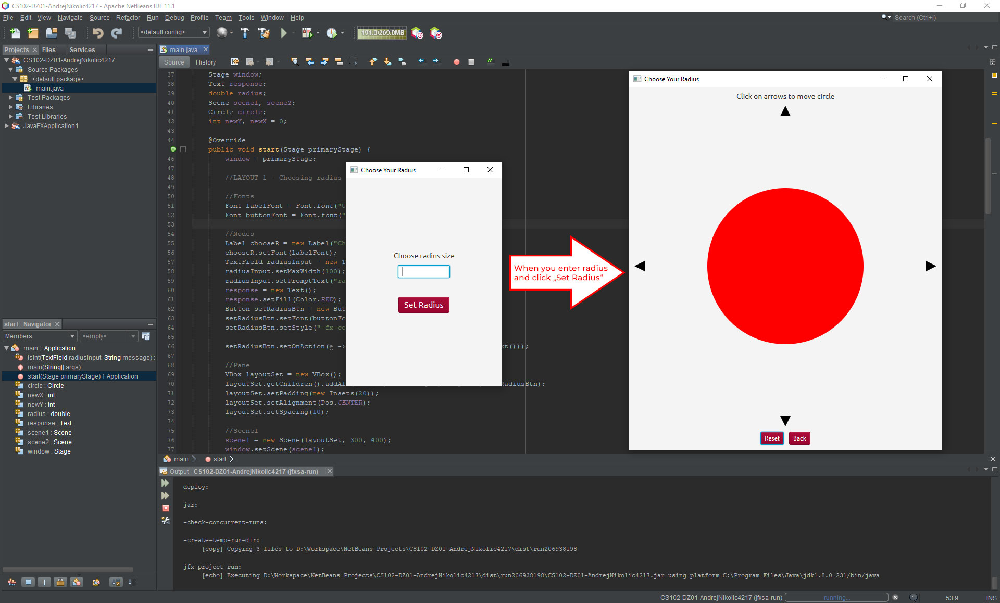

# javaFX-Practice01
JavaFX application that places a red circle of chosen radius, in the center of the scene color and that circle moves by clicking on one of 4 arrows in the direction of the arrow.

